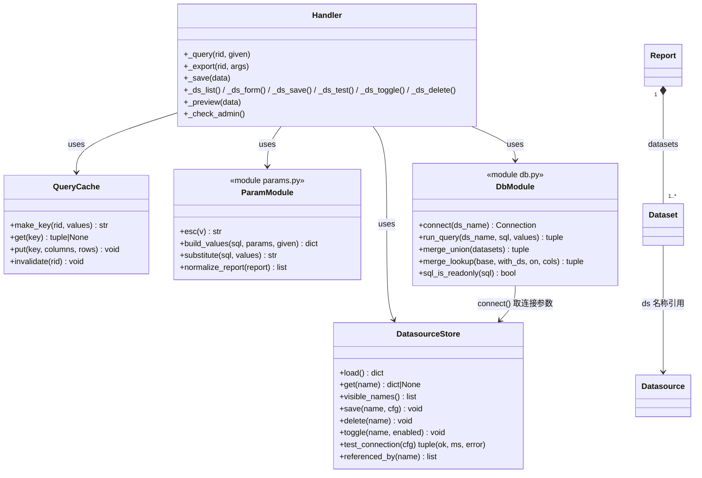
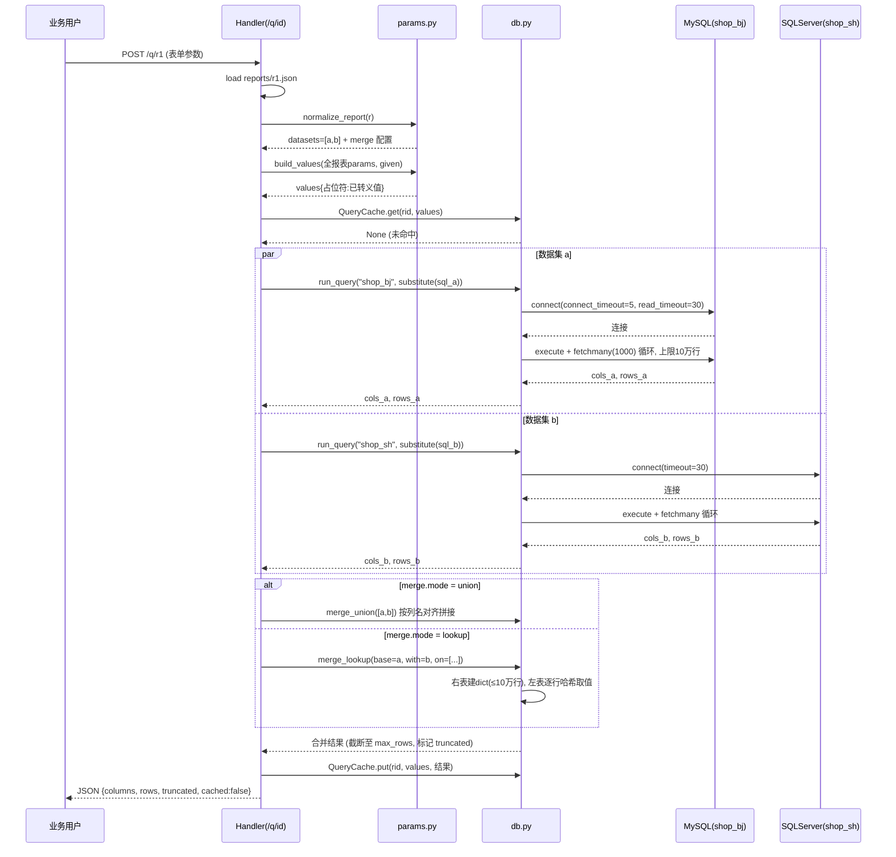
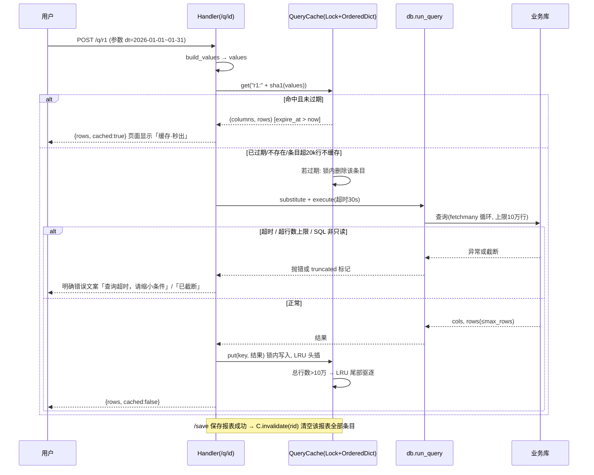
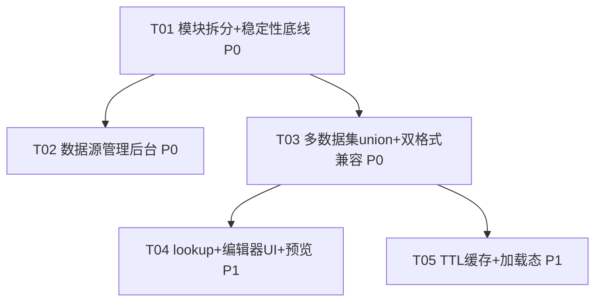

# sqlreport v0.2 — 增量架构设计与任务分解

作者：架构师 高见远 ｜ 状态：设计完成，待主理人汇总 ｜ 上游：docs/PRD-v0.2.md ｜ 基线：v0.1（PLAN.md）

---

## Part A：系统设计

### 1. 实现方案与模块划分

#### 1.1 难点分析

| 难点 | 分析 | 对策 |
|------|------|------|
| 数据源免重启生效 | v0.1 每次 `connect()` 都重读 `datasources.json`，天然免重启但重复 IO 且无原子写 | 引入 `mtime` 检测的进程内缓存 + 临时文件原子写（见 §7 取舍点 1/2） |
| 跨源联合查询 | 不做 SQL 下推，Python 侧合并。union 成本低；lookup（left join 取值）需防内存爆 | dict 哈希关联 O(n+m)，建侧行数上限 10 万行，超限拒绝并提示在 SQL 层先聚合（见 §3.3） |
| 大结果集内存 | `fetchall()` 全量拉取，百万行直接 OOM/卡死 | 游标 `fetchmany` 分批 + 硬上限；超时参数下沉到驱动层（见 §3.4） |
| 缓存与多线程 | `ThreadingHTTPServer` 多线程并发查询，缓存 dict 有竞态 | `threading.Lock` 保护的 TTL+LRU 缓存，~80 行实现 |
| 单文件膨胀 | server.py 现为 331 行，本版预计 +250~300 行 | **提前拆分数据层**（见 1.2），避免被动突破 800 行阈值 |

#### 1.2 模块划分决策：拆出 `db.py` + `params.py`，视图层留在 server.py

```
拆分前：server.py (331 行，数据层+参数层+HTTP层+视图层混杂)
拆分后：
  params.py  (~80 行)  esc / build_values / substitute / normalize_report —— 纯函数，无状态
  db.py      (~280 行) 数据源存取 / connect / run_query(限流) / 合并引擎 / QueryCache
  server.py  (~560 行) 路由 + 全部页面模板（含新增数据源管理页、编辑器数据集 UI）
```

**理由**：
1. **边界天然清晰**：数据层（连库、限流、缓存、合并）被 `/q`、`/export`、`/datasources/test`、`/preview` 四处复用，是本版改动最集中、最需要独立测试的部分；而视图层（HTML/JS 内联字符串）行数多但逻辑薄。
2. **server.py 预计 ~560 行 < 800 行阈值**，无需进一步拆 views；若后续 v0.3 视图再膨胀，届时拆 `views_admin.py` 即可，路由不变。
3. **params.py 独立**：占位符替换 + 双格式归一化是纯函数，配合 `python3 -m doctest` 可零成本单测，也是双格式兼容策略（取舍点 5）的唯一实现点。
4. 拆分后 `server.py` 顶部仅 `from db import ...; from params import ...`，对外路由与 URL **零变化**。

#### 1.3 架构模式

延续既有「单进程 + 文件即数据库 + 无框架」形态：`BaseHTTPRequestHandler` 路由分发 → `db.py` 数据访问（驱动懒加载不变：sqlite3 标准库 / pymysql / pyodbc）→ JSON 文件持久化。不引入任何新框架、不引入 Redis/外部组件。

### 2. 文件列表（新增/修改标注）

| 文件 | 状态 | 说明 |
|------|------|------|
| `db.py` | **新增** | 数据层：DatasourceStore（mtime 缓存+原子写）、connect()（含超时）、run_query()（fetchmany+行上限）、merge_union()/merge_lookup()、QueryCache（TTL+LRU）、sql_is_readonly() |
| `params.py` | **新增** | esc()、build_values()、substitute()（自 server.py 迁移）、normalize_report()（双格式归一化） |
| `server.py` | **修改** | 删除迁移走的函数；新增 /datasources* 路由与页面、/preview 接口；_query/_export/_save/_editor 改造为 datasets 感知 |
| `config.json` | **新增** | 全局配置：`{"admin_password": ""}`（空=仅本机可访问管理页） |
| `datasources.json` | **修改** | 条目增加 `timeout`/`enabled`/`note` 字段（旧字段全兼容，缺省自动补） |
| `reports/*.json` | **修改（格式）** | 新增可选 `datasets`/`merge`/`cache_ttl`/`max_rows` 字段，见 §3.1 |
| `.gitignore` | **修改** | 增补 `config.json` |
| `README.md` | **修改** | 数据源管理页用法、datasets 写法、部署建议（DBA 物化表） |
| `CHANGELOG.md` | **修改** | v0.2 变更记录 |
| `PLAN.md` | **修改** | 勾选完成项、更新模块结构图 |
| `docs/DESIGN-v0.2.md` | **新增** | 本文档 |

### 3. 关键数据结构与接口定义

#### 3.1 报表 JSON（v0.2，双格式兼容）

```jsonc
// 新格式（多数据集）
{
  "name": "分店订单汇总",
  "params": [ {"id":"dt","type":"daterange","label":"日期"} ],   // 参数全局共享，所有数据集用同一套
  "datasets": [
    {"name":"a", "ds":"shop_bj",  "sql":"SELECT order_id, amount FROM orders WHERE ..."},
    {"name":"b", "ds":"shop_sh",  "sql":"SELECT order_id, amount FROM orders WHERE ..."}
  ],
  "merge": {"mode":"union"},                                      // 纵向合并
  "cache_ttl": 300,      // 秒，0/缺省=不缓存
  "max_rows": 5000       // 结果行上限，缺省 2000
}
// lookup（横向关联，P1）：
"merge": {"mode":"lookup", "base":"a", "with":"b", "on":["cust_id"], "cols":["cname","level"]}
// base=主数据集(左表)，with=被关联数据集，on=关联键(可多列)，cols=从右表取的列(缺省=右表除键外全部列)

// 旧格式（单 SQL，完全兼容，读取时归一化为单数据集）
{ "name":"...", "ds":"mysql1", "sql":"...", "params":[...] }
```

**归一化规则**（`params.normalize_report()`，唯一入口，供 /q、/export、/save、/edit 共用）：
- 有 `datasets` → 原样使用（校验 name 唯一、ds 存在且未禁用）；
- 无 `datasets` 但有 `sql` → 视为 `[{"name":"main","ds":ds,"sql":sql}]`；
- **写回策略**：保存时若归一化后仅 1 个数据集，写回旧格式 `{ds, sql}`（保持旧文件 diff 稳定、旧编辑器可读）；≥2 个才写 `datasets`。

#### 3.2 数据源配置（datasources.json v0.2）

```jsonc
{
  "_template": { "type":"mysql", "host":"", "port":3306, "user":"", "password":"",
                 "database":"", "timeout":30, "enabled":true, "note":"" },
  "shop_bj": { "type":"mysql", "host":"10.0.0.1", "port":3306, "user":"ro_user",
               "password":"***", "database":"orders", "timeout":30, "enabled":true,
               "note":"北京分店只读库" }
}
```
- `timeout`（秒）：pymysql → `connect_timeout=5, read_timeout=timeout`；pyodbc → `cnxn.timeout=timeout`；sqlite → 本地文件无需（锁等待 `sqlite3.connect(path, timeout=5)`）。
- `enabled:false` 等价于旧 `_` 前缀隐藏语义（旧 `_` 前缀条目继续识别为禁用，向后兼容）。
- 写入走 `DatasourceStore.save()`：同目录临时文件 + `os.replace()` 原子替换 + `threading.Lock` 串行化。

#### 3.3 合并引擎与内存预算（取舍点 3）

- **union**：以第一个数据集列序为基准，按列名对齐（`dict(zip(cols,row))` 取值），缺失列填 `""`。逐数据集流式处理，不额外放大内存（峰值 ≈ 最大单数据集行数）。
- **lookup**：右表（`with`）全量构建 `dict{键tuple: 取值tuple}`，O(m) 建立后左表 O(n) 逐行查。**右表行数上限 100,000 行**，超限直接报错「关联表超 10 万行，请在 SQL 层先聚合/过滤」，右表重复键取首条（dict 后写不覆盖）。
- **内存预算估算**：单行 10 列字符串（均值 20 字节）≈ 0.9~1KB（str 对象 ~49B+len、tuple/list 开销 ~60B/行 + 8B/列指针）。
  - 查询硬上限 100,000 行 → 峰值 ≈ 100MB，单机可承受；
  - 缓存总预算 ≤ 100,000 行 ≈ 100MB；
  - 全局 `MAX_ROWS_FETCH = 100_000`（单数据集 fetch 硬顶）× 报表 `max_rows`（默认 2000，展示层截断并提示）双层控制。

#### 3.4 缓存结构（取舍点 4，QueryCache）

```python
# db.py
class QueryCache:
    """TTL + LRU 进程内缓存。key = f"{rid}:{sha1(canonical(params))}""""
    MAX_ENTRIES = 50          # 条目数上限
    MAX_ENTRY_ROWS = 20_000   # 单条目行数上限（~20MB），超限不缓存
    MAX_TOTAL_ROWS = 100_000  # 全表行数预算（~100MB），超限 LRU 驱逐
    # 内部：OrderedDict[key, (expire_at, columns, rows)] + threading.Lock
```
- **key**：`报表id + sha1(排序后的参数键值对 JSON)`。报表 SQL 变更不需要进 key——`/save` 保存成功即主动清除该报表全部缓存条目（PRD §6-4 建议，采纳）。
- **TTL 刷新**：惰性过期——命中时检查 `time.time() > expire_at` 则删除并视为未命中；不做后台清理线程（保持零线程开销）。
- 查询参数含空值/缺省值时按「实际生效值」参与 key（与 build_values 输出一致），避免同一结果因空参数写法不同而多份缓存。

#### 3.5 新增/变更路由

| 路由 | 方法 | 功能 | 优先级 |
|------|------|------|--------|
| `/datasources` | GET | 数据源列表页（密码打码、被引用报表、启用开关、编辑/删除/测试入口） | P0 |
| `/datasources/new`、`/datasources/edit/\<name\>` | GET | 新建/编辑表单 | P0 |
| `/datasources/save` | POST | 保存数据源（密码留空=不修改；写回原子生效） | P0 |
| `/datasources/test` | POST | 连接测试，返回 `{ok, ms, error}`；仅建连不执行 SQL | P0 |
| `/datasources/toggle` | POST | 启用/禁用（等价 `_` 前缀语义界面化） | P1 |
| `/datasources/delete` | POST | 删除（被引用时前端二次确认） | P1 |
| `/preview` | POST | 编辑器单数据集试运行，返回前 N=20 行（复用 run_query 限流） | P2 |
| `/q/\<id\>`、`/save` | POST | 对外签名不变；内部改造为 datasets 编排 + 缓存 + 明确错误 JSON | P0 |

查询响应 JSON 统一为 `{"columns":[...], "rows":[...], "truncated": bool, "cached": bool, "elapsed_ms": int}` 或 `{"error": "..."}`——前端据 `truncated` 显示「结果超 N 行已截断，请缩小条件」，据 `cached` 显示「缓存 x 秒前」。

#### 3.6 类图（完整版见 docs/class-diagram.mermaid）



### 4. 程序调用流程

**链路一：跨源联合查询（union / lookup）**



**链路二：缓存命中 / 未命中**



### 5. Anything UNCLEAR（架构侧假设）

1. **假设跨源场景以「纵向合并同类分店库」为主**（PRD Open Q1 未答复）——故 union 为 P0，lookup 为 P1；若用户答复以维表关联为主，仅 T04 提前，架构不受影响（merge 引擎已同时设计）。
2. **假设典型规模 ≤ 百万行明细**（Open Q2 未答复）——按 10 万行 fetch 硬顶 + 2000 行展示截断设计；若确认千万级，需将 T05 的 SQL 层分页提前为 P0。
3. **缓存 5 分钟默认可接受**（Open Q3）——`cache_ttl` 为报表级配置，实时报表设 0 即可，两种需求并存无冲突。
4. **数据源管理页保护**：默认「`admin_password` 为空时仅允许 127.0.0.1 访问，非空时 HTTP Basic」，需用户确认（Open Q 见 §8-6）。

---

## Part B：任务分解

### 6. 依赖包列表（保持零/低依赖）

```
- 无新增第三方包。标准库：http.server / sqlite3 / json / threading / hashlib / time / os / re
- 既有懒加载可选依赖（不新增）：pymysql（MySQL）、pyodbc（SQLServer）
```

### 7. 任务列表（≤5，按依赖排序）

#### T01 模块拆分 + 稳定性底线（R3 P0 核心）
- **内容**：迁移数据层/参数层出 server.py；实现超时（每数据源 `timeout`）、`fetchmany` 分批 + 10 万行 fetch 硬顶、只读 SQL 校验（去注释后首词必须 SELECT/WITH，拒绝 `;` 多语句）；`config.json` 骨架 + `.gitignore`。
- **文件**：新增 `db.py`、`params.py`、`config.json`；修改 `server.py`、`.gitignore`
- **依赖**：无 ｜ **优先级**：P0
- **验收**：全部路由行为与 v0.1 完全一致（回归）；超时/超限返回明确错误而非挂死；`python3 -c "import db, params"` 通过

#### T02 数据源管理后台（R1 P0+P1）
- **内容**：`/datasources` 列表/新建/编辑/保存/测试/启用禁用/删除全套路由与页面；DatasourceStore（mtime 免重启 + 原子写 + Lock）；密码打码与留空不改；引用检查（扫描 reports/*.json 统计引用）；管理页访问保护（`admin_password` 空=仅本机，非空=HTTP Basic）。
- **文件**：修改 `db.py`、`server.py`、`config.json`；修改 `README.md`
- **依赖**：T01 ｜ **优先级**：P0（引用检查/开关为 P1，随任务实现）
- **验收**：3 分钟内界面完成建源+测试+启用，全程不重启；密码不出现在列表页 HTML

#### T03 多数据集 union + 双格式兼容（R2 P0 + R3 P0 提示）
- **内容**：`normalize_report()` 归一化（读兼容旧格式/写回单数据集保持旧格式）；`merge_union()` 按列名对齐；`_query/_export` 改造为 datasets 编排（各数据集独立 connect/limit）；`/save` 校验 datasets；查询响应增加 `truncated/cached/elapsed_ms`，前端展示截断提示与错误文案。
- **文件**：修改 `params.py`、`db.py`、`server.py`；修改 `README.md`
- **依赖**：T01 ｜ **优先级**：P0
- **验收**：旧报表零改动正常查询/导出；两张异库表 union 出一张表；超 2000 行提示截断

#### T04 lookup 关联 + 编辑器数据集 UI + 预览（R2 P1/P2）
- **内容**：`merge_lookup()`（dict 哈希、右表 10 万行上限、重复键取首）；编辑器支持数据集块增删（name/ds/sql），全局参数共享说明；`/preview` 单数据集试运行前 20 行；导出对合并后最终结果生效（复用 T03 链路）。
- **文件**：修改 `db.py`、`server.py`；修改 `CHANGELOG.md`、`PLAN.md`
- **依赖**：T03 ｜ **优先级**：P1（preview 为 P2，同批实现）
- **验收**：MySQL 订单表 + SQLServer 客户表按键关联出表；编辑器分步预览可定位 SQL 错误

#### T05 TTL 缓存 + 查询加载态（R3 P1 + P0 收尾）
- **内容**：`QueryCache`（TTL+LRU+Lock，预算见 §3.4）；报表级 `cache_ttl` 编辑器字段；`/save` 清该报表缓存；viewer 页提交后 loading 态（按钮禁用+「查询中…」），错误/截断/缓存命中状态展示。
- **文件**：修改 `db.py`、`server.py`；修改 `CHANGELOG.md`、`PLAN.md`
- **依赖**：T03（T01 传递依赖）｜ **优先级**：P1
- **验收**：相同参数第二次查询走缓存（响应含 `cached:true`）；编辑保存后缓存失效；无实时报表配 `cache_ttl:0` 不缓存

### 8. Shared Knowledge（工程约定，Engineer 必读）

- 查询响应 JSON 统一 `{columns, rows, truncated, cached, elapsed_ms}` 或 `{error}`；错误信息一律中文、面向最终用户可读。
- 所有值仍以字符串传输/存储（延续 v0.1），`None → ""`；数值格式化属 P0-2（列类型保留），不在本版范围。
- 参数转义规则不变：可信 SQL 作者 + `''` 转义参数值；`substitute()` 整行丢弃语义不变，迁移时**不得改动正则与行为**。
- 文件写入统一走「临时文件 + `os.replace`」；`datasources.json` 写操作必须持 `db.py` 全局锁。
- 所有日期/时间戳用本地时间（单机内网工具，延续现状，不引入 UTC 转换）。
- 缓存 key 中的参数 canonical 化：`json.dumps(sorted(values.items()), ensure_ascii=False)`。

### 9. 任务依赖图



---

## 10. PRD §6 七个技术取舍点逐项决策

| # | 取舍点 | 决策 | 理由 |
|---|--------|------|------|
| 1 | 配置存储 | **继续 `datasources.json`（路径不变）**，写入改为「同目录临时文件 + `os.replace` 原子替换」+ `threading.Lock` 串行化 | 迁移 `config/` 目录收益仅为目录整洁，却破坏既有 gitignore/备份习惯与 v0.1 兼容；原子写已解决半写损坏；单机低频写，Lock 足够，无需文件锁 |
| 2 | 免重启生效 | **mtime 检测的懒加载缓存**：每次访问数据源时 `os.stat` 一次（微秒级），mtime 变化才重读解析；不提供手动刷新按钮 | 界面写回必然改 mtime，天然触发失效，零额外交互；os.stat 开销相对查询可忽略；比手动刷新可靠（防忘点） |
| 3 | 跨源合并内存模型 | union 按列名对齐流式拼接；lookup 用 **dict 哈希关联**（拒绝逐行查找 O(n·m)）；右表（建 dict 侧）行数上限 **100,000 行**，超限报错提示 SQL 层先聚合；整体 fetch 硬顶 10 万行，内存峰值预算 ≈100MB（估算见 §3.3） | dict 哈希 10 万×10 万 ≈ 秒级；逐行查找在 1 万×1 万即卡死；硬上限 + 明确报错优于静默 OOM |
| 4 | 缓存 key 与失效 | key=`报表id + sha1(canonical 参数)`；TTL 惰性过期（命中时检查，无后台线程）；**保存报表即清该报表全部缓存**；单条目 2 万行 / 全表 10 万行 / 50 条目上限，LRU 驱逐 | SQL 变更靠 save 失效（简单可靠），无需把 SQL 哈希进 key；无后台线程契合零依赖形态 |
| 5 | datasets 双格式兼容 | 读：`normalize_report()` 单一入口归一化（无 datasets → 单数据集 `main`）；写：归一化后仅 1 个数据集 → 写回旧 `{ds, sql}` 格式，≥2 个 → 写 `datasets` | 旧报表文件不被无谓改写（git diff 干净、可手改）；归一化集中在 params.py 一处，四处消费端零重复 |
| 6 | 管理页访问保护 | `config.json` 的 `admin_password`：**空 = 仅 127.0.0.1 可访问 /datasources\*（校验 remote_addr）**；非空 = HTTP Basic。业务用户照常免登录访问 `/r/<id>` | 零新依赖；内网部署（主要形态）本机管理够用；有远程管理需求时填口令即启用 Basic（标准库 `base64` 即可实现）；代理层路径控制写进 README 作为第三选项。**待用户确认后如需操作留痕再议（默认不做，无用户体系下仅能记 IP，价值有限）** |
| 7 | 单文件膨胀 | **提前拆分**：本版即拆出 `db.py`（~280 行）+ `params.py`（~80 行），server.py 预计 ~560 行 < 800 阈值；视图层暂不拆 | 800 行阈值是被动补偿，本版新增代码恰好集中在数据层（复用度高、需独立测试），主动拆的成本此刻最低；视图层（HTML 字符串）拆出反而割裂编辑器上下文 |

## 11. PRD §7 Open Questions 架构侧建议（业务结论留待用户）

| # | 问题 | 架构侧建议 |
|---|------|-----------|
| 1 | union 多还是 join 多？ | **建议默认 union 为主**（分店同类库汇总是此类工具最高频场景，成本也最低）。架构已两者兼容：若答复以 join 为主，仅需把 T04 提到 T03 之前，工作量不变 |
| 2 | 典型数据规模？ | **建议用户确认是否真有百万级明细**。当前设计支撑到 10 万行/查询、内存峰值 ~100MB；若确认千万级，SQL 层分页（方案 A）须从 P1 提为 P0，并考虑 SQLite 落盘缓存（P2 方案 B）提前 |
| 3 | 缓存 5 分钟可否接受？ | 架构无阻塞：`cache_ttl` 报表级配置，实时报表设 0 直连。建议产品侧提供默认值 300 并在编辑器注明「0=实时」 |
| 4 | 数据源管理操作留痕？ | **建议不做**：无用户体系下仅能记 IP，审计价值低；若未来上 P2-2 token 鉴权体系再一并考虑。降级方案：DEVLOG 约定手工变更也记录（零成本） |

---

*设计产出物：本文档、docs/sequence-diagram.mermaid、docs/class-diagram.mermaid*
